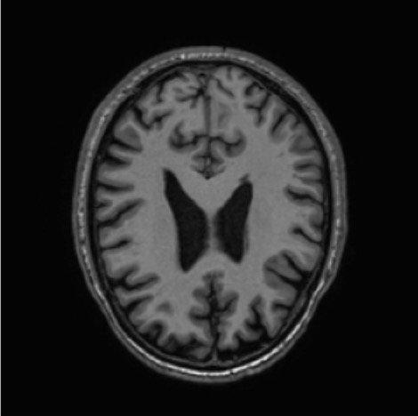
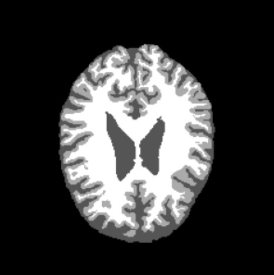
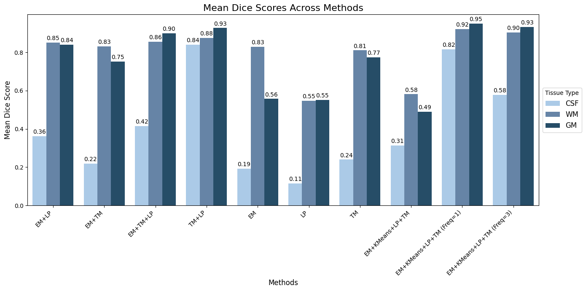

# Atlas and Tissue-Model Guided Gaussian Mixture Models for Brain Tissue Segmentation

This project implements a comprehensive brain tissue segmentation pipeline for **Magnetic Resonance Imaging (MRI)**. The approach combines **Gaussian Mixture Models (GMM)** with **Atlas-based** and **Tissue Probability Models** to segment brain tissues into **Grey Matter (GM)**, **White Matter (WM)**, and **Cerebrospinal Fluid (CSF)**. The pipeline integrates both spatial and intensity information for enhanced segmentation accuracy, evaluated using Dice similarity scores and Balanced Accuracy metrics.

---

## Overview

The segmentation pipeline involves the following steps:
1. **Atlas Registration**:
   - Performed affine and B-spline registration to align dataset images to a common space.
   - Generated a probabilistic brain atlas by averaging voxel-wise propagated labels.

2. **Tissue Probability Models**:
   - Created intensity-based probability maps for WM, GM, and CSF.
   - Smoothed histograms using Gaussian filters to refine probability distributions.

3. **Segmentation Methods**:
   - **Using Tissue Models**: Relied solely on intensity-based voxel classification.
   - **Using Probabilistic Atlas**: Utilized spatial information for segmentation.
   - **Combined Approach**: Integrated both intensity and spatial probabilities for enhanced results.

4. **Gaussian Mixture Models**:
   - Enhanced GMM computation with optimized convergence criteria and efficient Mahalanobis distance calculation.
   - Evaluated multiple initialization methods:
     - **K-means**
     - **Tissue Probability Models**
     - **Probabilistic Atlas**
     - **Combined Probabilistic Atlas and Tissue Models**

---

## Dataset

The dataset comprises 20 T1-weighted MRI scans and corresponding ground truth segmentation masks for WM, GM, and CSF.

### Example Dataset
| **T1-Weighted MRI Scan** | **Ground Truth Segmentation Mask** |
|---------------------------|------------------------------------|
|  |  |

---

## Experimental Results

### Key Findings
- **Best Performance**: The **EM+KMeans+LP+TM (Freq=1)** strategy achieved the highest Dice similarity scores:
  - **CSF**: 0.815
  - **WM**: 0.922
  - **GM**: 0.950
  - **Average Dice**: 0.896

- **Importance of Spatial Information**:
  - Segmentation methods incorporating spatial information significantly outperformed intensity-only approaches.

- **Challenges with CSF Segmentation**:
  - CSF segmentation exhibited lower accuracy due to its smaller volume and intensity similarity with GM.

### Results Summary
| Method                     | CSF Dice | WM Dice | GM Dice | Average Dice |
|----------------------------|----------|---------|---------|--------------|
| EM+KMeans+LP+TM (Freq=1)   | 0.815    | 0.922   | 0.950   | 0.896        |
| EM+TM+LP                   | 0.415    | 0.855   | 0.900   | 0.723        |
| TM+LP                      | 0.839    | 0.878   | 0.927   | 0.806        |
| EM                         | 0.193    | 0.829   | 0.557   | 0.526        |



---

## Quantitative and Qualitative Analysis

- **Quantitative Results**:
  - Methods integrating both probabilistic atlas and tissue models demonstrated superior Dice scores.
  - Spatial information was particularly beneficial for CSF segmentation, where intensity information was limited.

- **Qualitative Observations**:
  - Combined methods like EM+KMeans+LP+TM yielded smooth and anatomically consistent segmentations.

---

## Installation

Install the required dependencies with:
```bash
pip install -r requirements.txt
